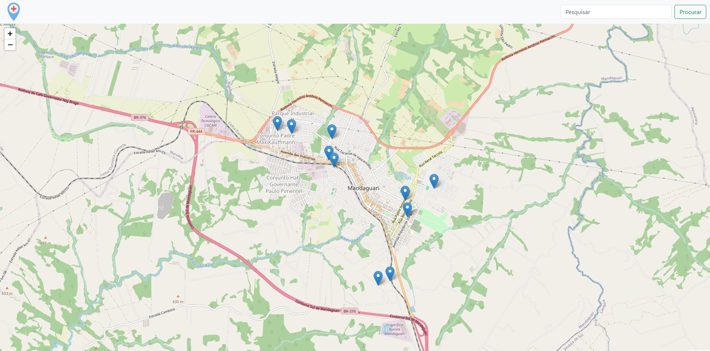

# AEP - 2025

Criar um site que será mostrado o mapa de Mandaguari - PR, onde estará marcado hospitais e postos de saúdes. Ao clicar em algum deles, será apresentado algumas informações, sendo elas, endereço, número para  contato, imagens do local, horário de atendimento, média de tempo de espera do lugar selecionado e a opção de agendar um horário para consulta ou vacinação.

## 🎥 Demonstração

## 🛠️ Construído com

Ferramentas e tecnologias utilizadas nesse projeto

- ✅ **HTML5** - Estruturação do site
- ✅ **CSS3** - Estilização e responsividade
- ✅ **JavaScript** - Utilização e interação do mapa
- ✅ **Bootstrap** - Agilidade e design intuitivo
- ✅ **Leaflet** - Mapa iterativo e eficaz

## 📄 Licença

Este projeto está sob a licença (queiroz) - veja o arquivo [LICENSE](https://github.com/ferqueiroz/AEP-2025/blob/main/LICENSE) para detalhes.

## 📩 Contato  

📧 **Email:** [ferqueiroz2205@gmail.com](mailto:ferqueiroz2205@gmail.com) 
📷 **Instagram:** [@_ferqueiroz](https://instagram.com/_ferqueiroz) 
👨‍💻 **GitHub:** [github.com/ferqueiroz](https://github.com/ferqueiroz)